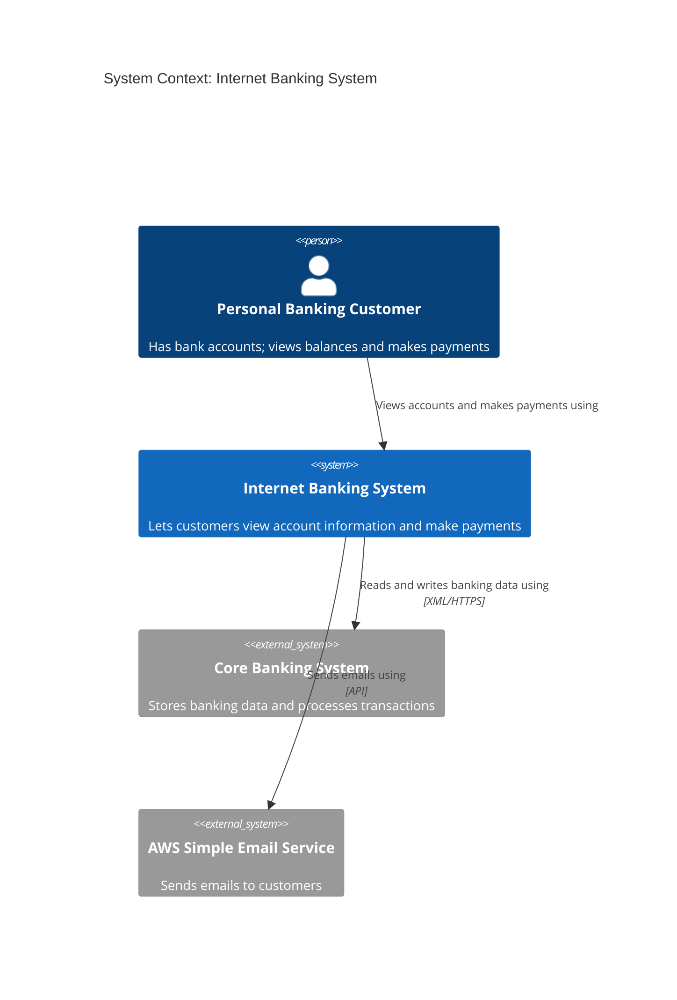
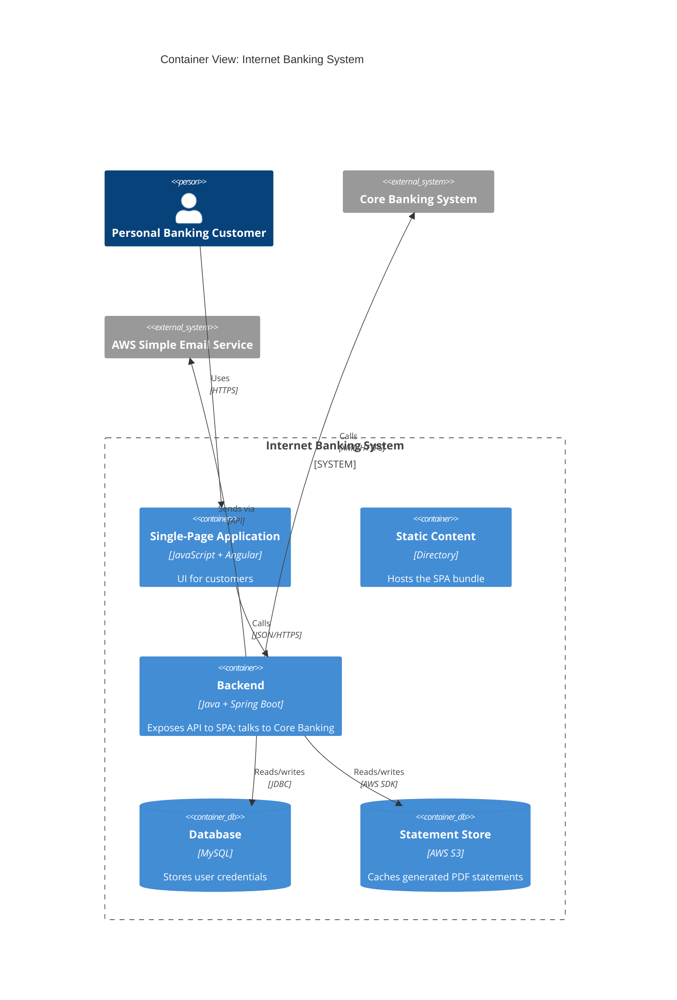
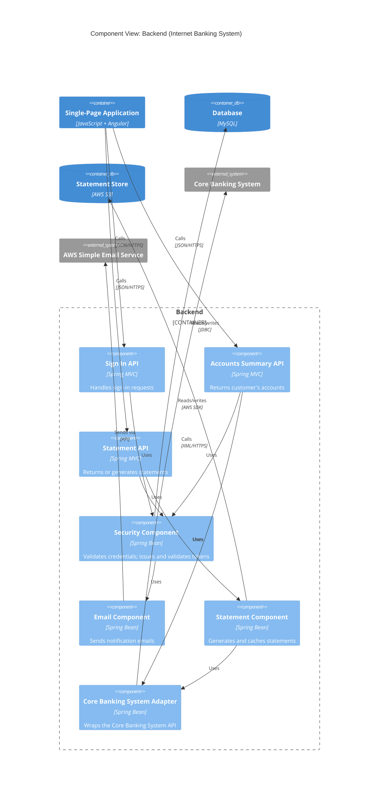

# C4 Model: Context, Container, Component

The C4 model gives three nested levels for documenting the static structure of a software system: System Context, Container, and Component. Each level zooms in one step further. This skill covers the rules for each level: what goes in, what stays out, what fields are required, and how levels stay consistent.

The fourth C4 level (Code, e.g. UML class) is out of scope here. Deployment, dynamic, and system landscape diagrams are also out of scope.

## The hierarchy

A **software system** is the unit of ownership. It is what one team builds, owns, and can see the internals of.

A software system contains one or more **containers**. A container is a separately deployable or runnable thing: an app, a service, a database, a file store. Communication between containers crosses a process or network boundary.

A container contains one or more **components**. A component is a grouping of related functionality behind a defined interface, running inside a container. Components are not separately deployable. All components inside a container share a process and can call each other in-process.

Below components sits code (classes, functions, modules). Not covered here.

**People** (actors, roles, personas) sit outside software systems and use them.

## Universal rules

These apply at all three levels.

1. Every element has a **name** and a **type tag** rendered in the label: `[Person]`, `[Software System]`, `[Container]`, `[Component]`. The tag removes ambiguity about which abstraction the box represents.
2. Every element has a **short description**.
3. Relationships are **unidirectional arrows**, each with a **short verb-phrase label** describing intent (`reads data from`, `sends emails using`, `validates token with`).
4. At Container level and below, relationships across a process boundary include a **technology/protocol** (`JSON/HTTPS`, `gRPC`, `AMQP`, `JDBC`).
5. Each diagram has a **title** that names its type and the element in focus (`System Context View: Internet Banking System`).
6. Each diagram has a **key/legend** unless the notation is universally understood by its audience.
7. Pick a notation and use it consistently. C4 is notation-independent. Mermaid `C4Context`/`C4Container`/`C4Component` is the default in this skill.

## Level 1: System Context

### Intent

Show the software system in scope, the people who use it, and the other software systems it interacts with. Answers:

- What is the software system?
- Who uses it?
- What do those users do with it?
- How does it fit into the existing system landscape?

### Scope

A single software system.

### Element types

Two only.

**Person**: a human user of the software system, modelled as an actor, role, persona, or named individual. Roles are the default; use personas or named individuals only when a specific user matters.

Required fields:
- `name`: the role, persona, or individual
- `description`: one short line

Person sub-vocabulary:
- **Functional user**: someone using the system to achieve a business goal. Always include these.
- **System administrator**: include only if the system has an admin UI built specifically for them.
- **Operational staff**: include only if they use a part of the system built for them (a dashboard, an admin API). Do not include people who only read log files.

If functional users and administrators have very different stories, draw two Context diagrams: one for functional users, one for admins/ops.

**Software System**: the system in scope, or another software system it interacts with.

Required fields:
- `name`
- `description`
- `in_scope`: boolean. The one in-scope system is rendered as the focus. External systems are rendered as external (greyed, dashed, or labelled `[Software System, external]`).

"Software System" is the hardest C4 abstraction to pin down. Other terms organisations use for the same thing: `application`, `product`, `service`, `platform`. A useful working definition: a single team builds it, owns it, is responsible for it, and can see its internals. Often the code lives in one repository (or one polyrepo set) that the team can modify freely. Often the boundary lines up with the team boundary, and the deployment is atomic.

### Out of scope at this level

- Technologies, frameworks, protocols
- Containers (applications and data stores)
- Components
- Deployment details: clouds, clusters, networks, servers

### Decision rules

- Internal applications and databases are **not** Software Systems. They are Containers and only appear on the Container diagram.
- Bounded contexts, product domains, business capabilities, tribes, squads, feature teams: **not** Software Systems. They are organisational, not architectural.
- A Software System is something a single team owns end-to-end, or an external dependency consumed via a public surface.

### Common mistakes

- Putting technologies on the diagram.
- Listing internal apps as separate Software Systems.
- Adding too many people. Only show the user roles relevant to the story.

### Mermaid example

## Level 2: Container

### Intent

Zoom into the software system. Show the applications and data stores inside it. Answers:

- How has the software system been decomposed into applications and data stores?
- What are their responsibilities?
- What are the primary technology choices?
- How do they communicate?
- Where do I add a feature?

### Scope

A single software system. The boundary is drawn as a box around the containers.

### Element types

Carry over from Context: all Persons and external Software Systems.

**Container**: an application or a data store. Something that must be running for the overall software system to work.

Required fields:
- `name`
- `technology`: implementation tech (`Java + Spring Boot`, `React`, `MySQL`, `AWS S3`). If unknown during up-front design, list candidates (`MySQL or PostgreSQL`) or a general type (`relational database schema`).
- `description`: responsibilities (apps) or what is stored (data stores).
- `kind`: one of the taxonomy entries below. Each kind gets a distinct shape (e.g. cylinder for `database`, queue shape for `queue`).

**Software System Boundary**: a labelled box around the in-scope containers.

#### Application container taxonomy

Vocabulary for the `kind` field when the container is an application. Use the closest match; record the concrete technology in the `technology` field.

| Kind | What it is | Example technologies |
|---|---|---|
| `server_side_web_app` | A web application that renders or serves pages and APIs from a server process | Java EE on Apache Tomcat, ASP.NET MVC on IIS, Spring Boot, Ruby on Rails on WEBrick, Node.js (Express, Fastify), Django, Flask |
| `client_side_web_app` | A single-page application running inside a web browser | React, Angular, Vue, Svelte, Backbone.js, jQuery, htmx |
| `client_side_desktop_app` | A desktop app running on the user's machine | WPF, Swift/Objective-C, JavaFX, Electron, Qt, GTK |
| `mobile_app` | A native or hybrid mobile app | iOS (Swift), Android (Kotlin/Java), React Native, Flutter |
| `server_side_console_app` | A standalone process (a `main` entry point) | Java/C#/C++/Python/Perl/Go/Rust binaries, long-running workers, batch jobs |
| `serverless_function` | A single function deployed to a FaaS platform | AWS Lambda, Azure Function, Google Cloud Function, Cloudflare Workers |
| `shell_script` | A script that runs in a shell | Bash, Zsh, PowerShell, fish |

#### Data store container taxonomy

Vocabulary for the `kind` field when the container is a data store.

| Kind | What it is | Example technologies |
|---|---|---|
| `relational_database` | A schema inside a relational DBMS | MySQL, PostgreSQL, MS SQL Server, Oracle Database, MariaDB, SQLite |
| `document_store` | A collection of documents in a document database | MongoDB, Couchbase, AWS DocumentDB |
| `graph_database` | A graph in a graph database | Neo4j, Amazon Neptune, ArangoDB |
| `key_value_store` | A NoSQL key-value or wide-column store | Redis, Riak, Cassandra, DynamoDB, etcd |
| `blob_store` | An object/blob store or content store | AWS S3, Azure Blob Storage, Google Cloud Storage, MinIO, CDN content |
| `file_system` | A local filesystem or a portion of a networked one | local disk, SAN, NAS, NFS mount |
| `queue` | A message queue or topic | Kafka, RabbitMQ, AWS SQS, AWS SNS, NATS, Redis streams |
| `search_index` | A search/indexing store | Elasticsearch, OpenSearch, Solr, Meilisearch |

The book lists the first five data-store kinds explicitly. Queues and search indices are not in the book's enumeration but follow the same isolation principle and are commonly treated as Containers in practice.

#### The isolation principle

A container is a runtime concept: a boundary around code that is executing or data that is being stored. Containers have a degree of isolation from one another, regardless of where they are deployed.

Two consequences:

1. Communication between containers requires an out-of-process or remote call across a process or network boundary. This is why Container-level relationships carry a protocol.
2. Two containers can share the same OS process or the same DBMS instance and still be separate Containers. Example: two Java EE web apps in one JVM, isolated via class loaders. Example: two database schemas in one MySQL server, isolated by the schema boundary.

The shape on the diagram does not depend on deployment. A Lambda function and a long-running JVM service are both Containers.

#### "C4 container" disambiguation

The word `container` collides with Docker/Kubernetes/OCI containers. They are not the same concept. A Docker container is a deployment unit; a C4 Container is an application or data store at a logical level. One C4 Container may map to one Docker container, many, or none. Use `C4 container` to disambiguate when context is unclear.

### Out of scope at this level

- Deployment specifics: which Kubernetes cluster, which region, which load balancer, which firewall. These go on a deployment diagram (one per environment).
- Component-level decomposition.

### Decision: Software System or Container?

When something external is in play (cloud service, third-party API), decide:

- The team controls what is inside it and treats it as integral to the system → **Container**. Example: an S3 bucket your team owns and populates.
- The team only calls its API and treats it as an external dependency → **Software System**. Example: AWS SES used to send transactional emails.

Both can be from the same provider (AWS). Ownership and control decide the level, not the vendor.

### Common mistakes

- Including infrastructure (load balancers, gateways, firewalls). Those go on deployment diagrams.
- Omitting `technology`. Without it, the diagram cannot expose design flaws (e.g. a browser-side React app trying to talk to a database directly).
- Hand-waving protocols. `HTTP` is not enough if the team is choosing between REST and gRPC.

### Mermaid example

## Level 3: Component

### Intent

Zoom into one container. Show the components inside it. Answers:

- How has the container been decomposed?
- What are the responsibilities of each component?
- How do components collaborate?
- What frameworks/libraries implement them?
- Where do I add a feature?

### Scope

A single container. If the software system has three application containers, draw three component diagrams, one per container. Never combine.

Do not draw component diagrams for data-store containers. Use entity-relationship diagrams instead.

### Element types

Carry over from Container: all Persons, external Software Systems, and sibling Containers. One of the Containers is now drawn as the boundary instead of a box.

**Component**: a grouping of related functionality encapsulated behind a well-defined interface, running inside a single container. A component is a collection of code, one level of abstraction above the language's native building blocks. Components are not separately deployable; the container is.

Required fields:
- `name`
- `technology`: framework or library used (`Spring MVC controller`, `Spring Bean`, `Go package`, `Express router`, `React hook`).
- `description`: responsibilities.

#### Component vocabulary by language

What counts as a component depends on the programming language. Use this to bound what tree-sitter or AST analysis should collapse into a single Component.

| Language family | A component is typically | Concrete examples |
|---|---|---|
| Java, C#, C++ (OO) | A collection of classes, interfaces, and enums | A Spring Bean + its interface; a set of related classes in one package |
| C (procedural) | A collection of files in a particular directory | All `.c`/`.h` files in `src/auth/` |
| F#, Haskell (functional) | A module: a logical grouping of related functions and types | An `Auth` module exposing `signIn`, `signOut`, `User` |
| JavaScript, TypeScript | A JavaScript/TS module: related functions and objects | An `auth.ts` module; a barrel-exported `auth/` folder |
| Go | A package | An `auth` package with its exported types and functions |
| Python | A package or module | An `auth` package; an `auth.py` module |
| Rust | A module or crate | An `auth` module within a crate; a sub-crate in a workspace |

A component is *not* a class, a single function, or a file. If extraction collapses each class into its own Component, the granularity is wrong; cluster first, then label.

#### Component vocabulary by framework idiom

Useful when classifying components extracted from real codebases. Each row is a recognisable component pattern.

| Framework idiom | Typical component kind |
|---|---|
| Spring MVC `@Controller` / `@RestController` | API/controller component |
| Spring `@Service` or `@Component` (Spring Bean) | Service or domain component |
| Spring `@Repository` | Repository / data access component |
| ASP.NET Controller | API/controller component |
| Django views.py / DRF ViewSet | API/controller component |
| Django models + manager | Data access component |
| Express/Fastify route module | API/controller component |
| NestJS `@Injectable` provider | Service component |
| Go HTTP handler package | API/controller component |
| Adapter or gateway class wrapping an external system | Adapter component |

When the codebase uses a clear architectural style, the components on the diagram should reflect it.

#### Architectural styles

The component decomposition should mirror the style the codebase actually uses. Common styles to recognise and represent:

- **Layered**: presentation / application / domain / persistence. Draw components grouped by layer.
- **Ports and adapters (hexagonal)**: a domain core surrounded by ports (interfaces) and adapters (implementations for HTTP, DB, queues, external systems). Draw the core distinctly from the adapters.
- **Onion / clean architecture**: similar to hexagonal; domain at the centre, infrastructure at the edge.
- **Vertical slice / feature-based**: each feature is a self-contained vertical including its API, service, and persistence. Draw one component group per feature.
- **MVC / MVP / MVVM**: model, view, controller (or presenter, view-model). Draw components grouped by role.

If extraction cannot detect the style, default to ports-and-adapters labelling for service-style containers and layered labelling for monolithic ones.

**Container Boundary**: labelled box around the components. Corresponds to the single Container box on the Container diagram.

**Software System Boundary** (optional, recommended): outer box showing which software system the container lives in.

### Relationship rules at this level

Most component-to-component calls are in-process method or function calls. **Omit the technology field for in-process calls.** Use it only when the component talks across a container boundary (to another container, or to an external system).

### When NOT to draw a component diagram

- For data-store containers.
- For trivial application containers (e.g. a microservice with one endpoint). Nothing to decompose.
- For manually-maintained long-lived documentation. Component structure changes too often for hand drawings to stay accurate.

When the diagram can be auto-generated from code, it becomes worth keeping as living documentation. Otherwise reserve component diagrams for up-front design of small-to-medium applications.

### Common mistakes

- Mapping components 1:1 to classes. A component is a *grouping* of code. If every component is one class, the decomposition is too fine.
- Showing in-process calls with full HTTP-style protocol labels. They are method calls. Leave technology blank.
- Mixing components from multiple containers on one diagram.
- Letting the diagram balloon past ~15 components. At that point, split or summarise.

### Mermaid example

## Cross-level consistency

Every element at a higher zoom level must reappear at the lower zoom level if it stays in scope.

| Element | Context | Container | Component |
|---|---|---|---|
| Person | yes | yes | yes |
| Software System in scope | yes (single box) | yes (as boundary) | yes (as outer boundary, optional) |
| Software System external | yes | yes | yes |
| Container | no | yes | yes (siblings shown; one becomes the boundary) |
| Component | no | no | yes |

When you zoom in, replace a generic outer relationship with a more specific inner one. `Customer uses Internet Banking System` at Context becomes `Customer uses Single-Page Application` at Container.

If an element appears at a lower level that has no parent at a higher level, the model is inconsistent. Fix the parent diagram, not the child.

## Validation checklist

Run this on any C4 set produced by extraction or by hand.

**Per element**
1. Type tag present (`[Person]`, `[Software System]`, `[Container]`, `[Component]`).
2. Description present.
3. Containers and Components have `technology` (or explicit `unknown` if extraction could not determine it).
4. Containers have `kind` set to `app` or `data_store`.

**Per relationship**
5. Direction is explicit (arrow, not bare line).
6. Label is a short verb phrase describing intent.
7. Cross-process calls at Container or Component level have a `technology` or protocol.
8. In-process Component-to-Component calls do not have a technology.

**Per diagram**
9. Title names the diagram type and the element in focus.
10. Software System Boundary drawn on Container and (optionally) Component diagrams.
11. Container Boundary drawn on Component diagrams.
12. No deployment elements (clusters, load balancers, firewalls, gateways).
13. No infrastructure containers masquerading as Software Systems.

**Cross-level**
14. Every Person on Container also appears on Context.
15. Every external Software System on Container also appears on Context.
16. The Container being decomposed on a Component diagram is one of the Containers on the Container diagram.
17. Sibling Containers shown on a Component diagram match the Container diagram.

## Picking the right level for an element

Use this decision flow when you are not sure where something belongs.

1. Is it a human role or persona? → **Person** (Context level).
2. Is it a system owned by another team, vendor, or product, consumed via a public surface? → **external Software System** (Context, repeated on lower levels).
3. Is it the system in focus, considered as a whole? → **in-scope Software System** (Context only as a box; Container as a boundary).
4. Is it independently deployable or runnable, and your team owns what is inside it? → **Container** (Container level).
5. Is it a grouping of code inside a single deployable unit? → **Component** (Component level).
6. Is it a class, function, or other code-level construct? → **Code** (out of scope here).
7. Is it a load balancer, firewall, cluster, region, VM, or other deployment artefact? → not C4 static structure; goes on a deployment diagram.
8. Is it a bounded context, business capability, team, or product line? → not a C4 element; organisational concept.

## Implementation notes for extraction pipelines

When extracting C4 from source code (the typical use case):

- Extract **bottom-up if the codebase is concrete** (Container first from compose files, Helm charts, Terraform, manifests; then Component from AST-level analysis per service; then Context by inverting external dependencies). Bottom-up grounds every element in evidence.
- Extract **top-down if the source is design intent** (architecture decision records, design docs). Top-down lets Context constrain what to look for.
- For each extracted element, record provenance: which file, which line range, which evidence kind (deployment manifest, import graph, framework annotation, configuration).
- Keep technology fields populated from concrete evidence (framework imports, Dockerfile base image, package manager manifest) rather than inferred.
- Treat `unknown` as a first-class value. An honest gap is better than a hallucinated technology.
- Component clustering (e.g. Louvain on the call/import graph) is a useful pre-step before LLM classification. It bounds the LLM's job from "find components" to "label these clusters".

## When this skill applies

Use it whenever:
- Creating or reviewing C4 Context, Container, or Component diagrams.
- Building or modifying a tool that produces C4 outputs from source code.
- Validating a C4 model emitted by another tool.
- Translating ad-hoc architecture diagrams into proper C4.
- Deciding which level a given element belongs to.
- Writing prompts for LLM agents that classify or label architectural elements.

Do not use it for deployment diagrams, dynamic/sequence diagrams, code-level (UML class) diagrams, system landscape diagrams, or ArchiMate/UML/SysML notation. Those have their own rules.
